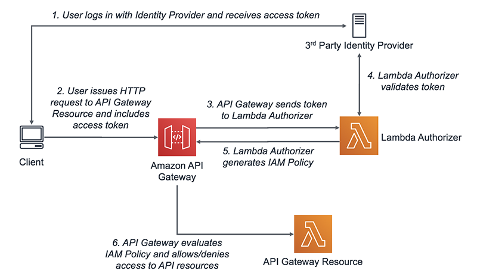

# Cloud in the Pocket

<details name="branch">
    <summary style="font-size: 32px;">01 - Check the prerequisites and run the CLI examples</summary>

* Show the initial code and explain it
* Check that all prerequisites are installed
    * Docker
    * aws
    * aws credentials and profiles created
    * awslocal
    * localstack account created and activated hobby plan (show in browser)

```shell

# Check the versions of the tools installed
docker -v && \
aws --version  && \
awslocal --version
```

<details style="margin-inline-start:24px">
    <summary style="font-size: 24px">Interactive Part</summary>

* Create directory for docker
    * Add the services into docker-compose for postgres and localstack. And each line explained
    * Add .env file for postgres
    * Add helper scripts into root package.json
    * Start the docker services
    * Show the `cli` examples of the bucket creation

```shell
# let's create a test bucket in the localstack
awslocal s3 mb s3://test-bucket
```

```shell
#check if bucket is created
awslocal s3 ls
```

```shell
# upload file to the bucket
awslocal s3 cp "${PWD}/ecosystem.config.cjs" s3://test-bucket/ecosystem.config.cjs
```

```shell
# stream file into stdout in terminal
awslocal s3 cp s3://test-bucket/ecosystem.config.cjs -
```

```shell
# download file from s3 to local directory 
awslocal s3 cp awslocal s3 cp s3://test-bucket/ecosystem.config.cjs ecosystem.config_downloaded.cjs 
```

```shell
#destroy the bucket (force to remove bucket with any images in it)
awslocal s3 rb s3://test-bucket --force
```

_Proof that such kind of work is ok to know the basics of aws cli
but completely not sufficient to deal with complex infrastructure settings_
</details>
</details>

---

<details name="branch">
    <summary style="font-size: 32px;">02 - Primitive automation example</summary>

* Describe `scripts` directory created in the root of the project
* Some scripts added form the start

<details style="margin-inline-start:24px">
 <summary style="font-size: 24px">Interactive Part</summary>

### Interactive part

* Run all scripts in `/scripts` directory in a sequence
* Check that /register /login /users endpoint are working
* Describe and show with example of pre-created script for API Gateway why it is not optimal

</details>
</details>

---

<details name="branch">
    <summary style="font-size: 32px">03 - Continue automation, use localstack lifecycle stages</summary>

### Work with LocalStack lifecycle stages and hooks

```
/etc
└── localstack
    └── init
        ├── boot.d           <-- executed in the container before localstack starts
        ├── ready.d          <-- executed when localstack becomes ready
        ├── shutdown.d       <-- executed when localstack shuts down
        └── start.d          <-- executed when localstack starts up
```

<details style="margin-inline-start:24px">
 <summary style="font-size: 24px;">Interactive part</summary>

* Update docker-compose to have the localstack scripts directory mounted
* Move there some scripts and describe how this stuff works
* Make all files in `localstack_scripts` directory executable by running `chmod -R +x docker/localstack_scripts`
* Add `"lambda:create": "./scripts/4_create-lambda.sh"` to npm scripts section
* Add authenticator and users lambdas to localstack from the `npm scripts`
* Show why this already a better solution but still there is a room for improvement

</details>
</details>

---

<details name="branch">
<summary style="font-size: 32px">04 - Automation Evolution, provide IaC solution</summary>

* Introduce the __CDK__
    * Explain what is this
    * Check the prerequisites

```shell

echo "CDK - $(cdk --version)" && \
echo "CDK-LOCAL - $(cdklocal --version)"
```

<details style="margin-inline-start:24px">
<summary style="font-size: 24px">Interactive part</summary>

* Init the cdk application `mkdir app && cd app && cdk init app --language typescript`
* Jump to the source for a bit

</details>
</details>

---

<details name="branch" open>
    <summary style="font-size: 32px">05 - Jump Into Prepared Code</summary>

* Have all previously created code in place
* Describe what already created - just to save time
    * Show the working solution for existing code of application
    * Run the possible requests scenarios

<details style="margin-inline-start:24px">
  <summary style="font-size: 24px">Interactive part</summary>

### Let's implement the next missing functionality

1. Add possibility to users to update information about them
    1. PUT method in users lambda
    2. Add resources in ApiGateway
    3. Update integrations if needed
    4. ... check for other steps and annotate them
    5. Rebuild CDK-LOCAL
2. Protect existing routes / lambdas using Lambda Authorizer 
    1. Create Lambda to validate the request
    2. Describe what the policies are
    3. Update ApiGateway configuration 
    4. Rebuild CDK-LOCAL
3. Add possibility to store the attachments
    1. Create Attachments lambda
    2. Explain the flow of the file upload form the user and S3 perspective. Explain the constraints of the ApiGateway
       and Lambda
    
    
</details>
</details>
